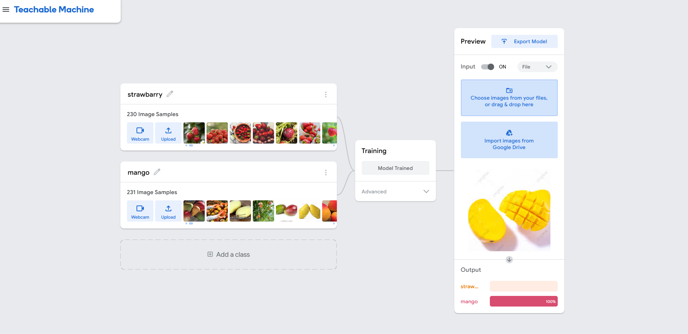
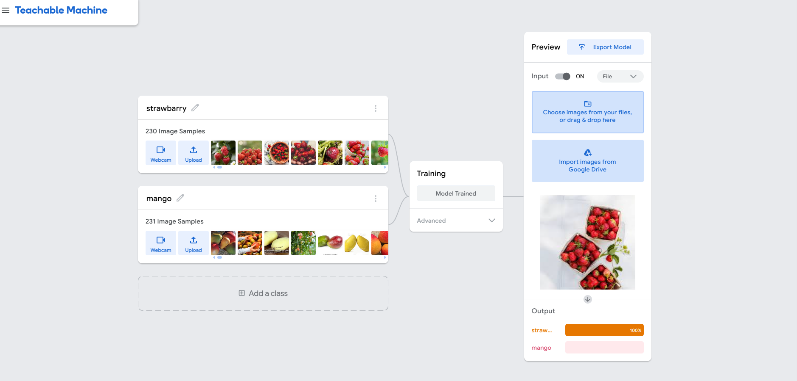

# fruits-classifier
---
# 🍓🥭 Fruit Classifier using Teachable Machine & Keras

A simple image classification tool that detects **Strawberries** and **Mangoes** using a model trained with **Google's Teachable Machine** and deployed using **Keras** in Python.

---

## 📌 Project Overview

This project demonstrates how to:

* Train a fruit classifier using **Teachable Machine** by Google.
* Convert the trained model to **Keras (.h5)** format.
* Build an inference pipeline in **Python** using **Keras**, **NumPy**, and **Pillow**.
* Classify fruit images (Strawberry or Mango) with a notebook or script.

---

## 🧠 Model Details

* **Framework**: Teachable Machine → Keras
* **Classes**: `Strawberry` 🍓 and `Mango` 🥭
* **Input Size**: 224x224 pixels
* **Model Format**: `.h5` (Keras)

---

## 📂 Project Structure

```
├── converted_keras/           # Keras model (.h5) and labels.txt
├── fruits_classifier.ipynb    # Jupyter Notebook for image classification
├── fruit_dataset.zip          # Sample images for testing
├── screenshots/               # Optional: UI/output screenshots
├── README.md                  # Project documentation
```

---

## 🚀 How to Run

### 1. Install Dependencies

```bash
pip install tensorflow pillow numpy
```

### 2. Run the Classifier

Open the Jupyter notebook:

```bash
jupyter notebook fruits_classifier.ipynb
```

Follow the instructions to upload images and get predictions.

---

## ✅ Example Output

```
Image: sample1.jpg
Prediction: Strawberry 🍓
Confidence: 98.5%

Image: sample2.jpg
Prediction: Mango 🥭
Confidence: 99.3%
```

---

📸 Screenshots
Here are some example screenshots showing how the model was trained and used for prediction:

🔍 Teachable Machine Training
Strawberry and Mango Classes (230+ Images each)


Prediction Example: Mango Classified with 100% Confidence


Prediction Example: Strawberry Classified with 100% Confidence


🖼️ Sample Fruits Used
Mango


Strawberry



---

## 🛠 Possible Improvements

* Build a simple web UI using **Flask** or **Streamlit**
* Expand to include more fruit types
* Add support for real-time webcam detection

---

## 🤝 Credits

Developed by **Safwan-Alemam**
Model trained using [Teachable Machine by Google](https://teachablemachine.withgoogle.com/)
